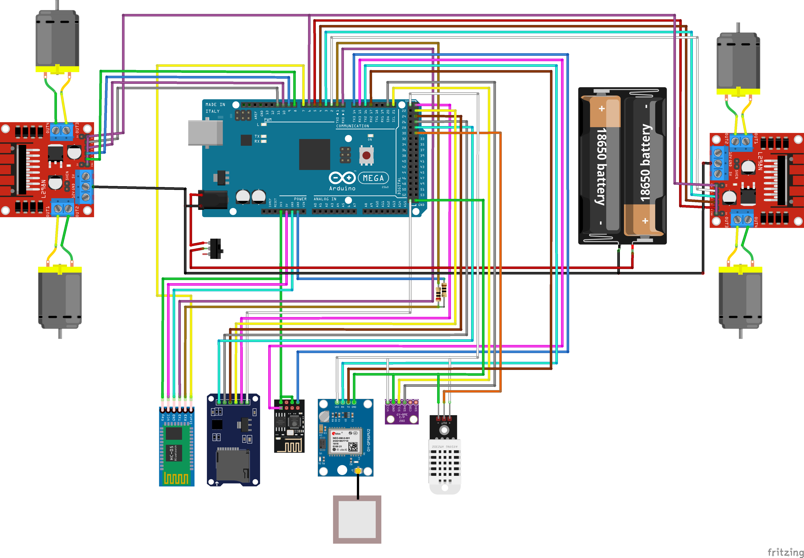

# Метеостанция на колесах

### Схема подключения модулей к плате
##### res/Project_bb.png если захотите ближе рассмотреть подключение

### Для прошивки платы использовались следующие библиотеки
- GyverBME280 1.5.3 от AlexGyver
- DHT22 1.0.7 от dvarrel
- HCSR04 2.0.0
- NewPing 1.9.7
- SD 1.3.0

#### Над проектом трудились
- Воронцов Юрий
- Бондаренко Егор
